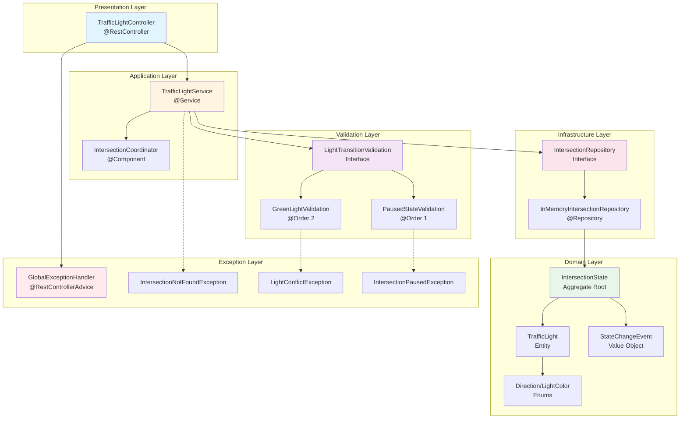

# How to use Project

BUILD:
1. mvn clean install
2. RUN from Intellij

URL:
Swagger: http://localhost:8080/swagger-ui.html

Highest standard VAT: http://localhost:8080/euRates?type=TOP&limit=3
output:
[
{
"_comment": null,
"iso_duplicate": null,
"iso_duplicate_of": null,
"country": "Hungary",
"standard_rate": 27.0,
"reduced_rate": "18.00",
"reduced_rate_alt": "5.00",
"super_reduced_rate": "false",
"parking_rate": "false"
},
{
"_comment": null,
"iso_duplicate": null,
"iso_duplicate_of": null,
"country": "Denmark",
"standard_rate": 25.0,
"reduced_rate": "false",
"reduced_rate_alt": "false",
"super_reduced_rate": "false",
"parking_rate": "false"
},
{
"_comment": null,
"iso_duplicate": null,
"iso_duplicate_of": null,
"country": "Croatia",
"standard_rate": 25.0,
"reduced_rate": "13.00",
"reduced_rate_alt": "5.00",
"super_reduced_rate": "false",
"parking_rate": "false"
}
]

SWAGGER UI:

Lowest reduced VAT : http://localhost:8080/euRates?type=LOW&limit=3
OUTPUT:
[
{
"_comment": "While the EU uses the country code 'UK' for the United Kingdom, ISO uses 'GB' - both are included for convenience.",
"iso_duplicate": "GB",
"iso_duplicate_of": null,
"country": "United Kingdom",
"standard_rate": 20.0,
"reduced_rate": "5.00",
"reduced_rate_alt": "false",
"super_reduced_rate": "false",
"parking_rate": "false"
},
{
"_comment": "Duplicate of GB for convenience; the EU uses the country code 'UK' for the United Kingdom, while ISO uses 'GB'.",
"iso_duplicate": null,
"iso_duplicate_of": "UK",
"country": "United Kingdom",
"standard_rate": 20.0,
"reduced_rate": "5.00",
"reduced_rate_alt": "false",
"super_reduced_rate": "false",
"parking_rate": "false"
},
{
"_comment": null,
"iso_duplicate": null,
"iso_duplicate_of": null,
"country": "Netherlands",
"standard_rate": 21.0,
"reduced_rate": "6.00",
"reduced_rate_alt": "false",
"super_reduced_rate": "false",
"parking_rate": "false"
}
]

## Architecture

